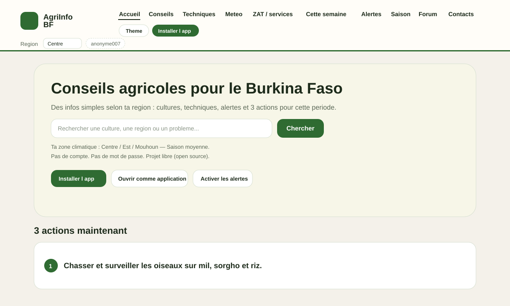
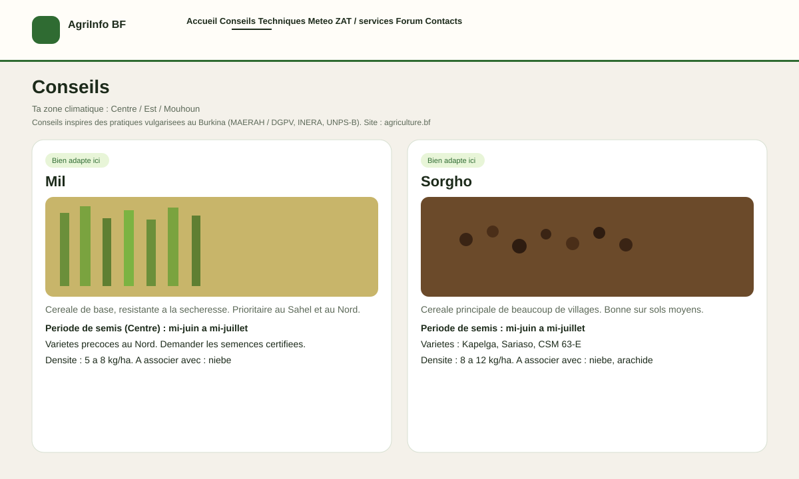
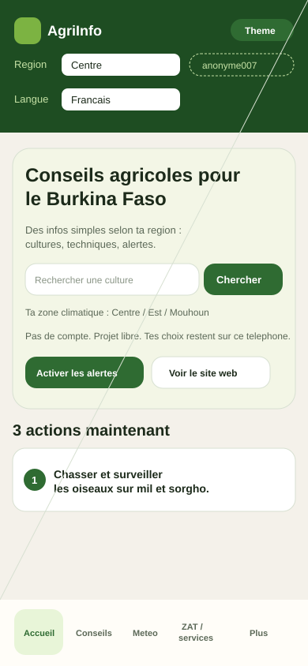
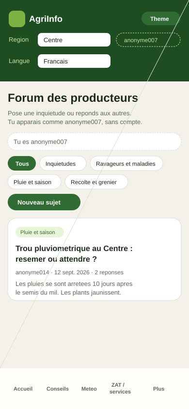

# AgriInfo BF

Conseils agricoles simples pour le Burkina Faso.

Site web classique + application mobile (PWA à installer).
Pas de compte. Pas de mot de passe. Open source.

> Version de travail. Les conseils aident au champ ; ils ne remplacent pas le ZAT, la Direction provinciale de l’Agriculture ni les bulletins ANAM.

## Captures d’écran

### Site web

Accueil (barre du haut, recherche, actions de la période) :



Fiches cultures (mil, sorgho, photos réelles, conseils par zone) :



### Application mobile (PWA)

Accueil avec onglets en bas, puis forum anonyme (`anonyme007`) :




Ouvre `index.html?shell=app` ou installe la PWA depuis le bouton **Installer l’app**.

## Ce que fait le projet

- Fiches cultures (mil, sorgho, maïs, riz, arachide, coton, niébé, sésame, oseille, tomate, voandzou…)
- Techniques : zaï, demi-lunes, compost, paillage, associations
- 3 actions de la période + alertes selon le mois et la zone
- Météo 7 jours (chiffres Open-Meteo) + liens officiels ANAM
- ZAT / services : chaîne UAT → ZAT → DPARAH → DRARAH → MAERAH
- Contacts ministère, INERA, UNPS-B, SOFITEX, FAO…
- Forum anonyme local (`anonyme007`) — messages dans le navigateur seulement
- Langues : français et anglais pour l’instant — **on cherche des traductions en mooré, dioula et fulfuldé**
- Hors-ligne après la première ouverture (service worker)

## Lancer en local (pas d’hébergement requis)

```bash
git clone https://github.com/ouedraogojudicael227-blip/AgriInfo-Bf.git
cd AgriInfo-Bf
python3 -m http.server 8080
```

Ouvre `http://localhost:8080` (site) ou `http://localhost:8080/index.html?shell=app` (vue application).

## Branches

- `main` — version stable. **Personne ne pousse directement dessus.** Il faut une pull request.
- `develop` — travail en cours.
- `i18n/langues-locales` — traductions mooré, dioula, fulfuldé.

## Contribuer

Lis [CONTRIBUTING.md](CONTRIBUTING.md).

**Ce qu’on attend surtout : traduire l’interface en langues locales** (mooré, dioula, fulfuldé) dans `js/i18n.js`, depuis la branche `i18n/langues-locales`.

Aussi bienvenus ensuite :

- photos réelles niébé et sésame au Burkina (licence libre)
- numéros DPARAH / ZAT vérifiés sur place
- corrections de conseils d’après fiches INERA / DGPV

## Structure

```
├── index.html              Accueil
├── conseils.html           Fiches cultures
├── techniques.html
├── semaine.html            3 actions
├── alertes.html
├── saison.html
├── meteo.html              Prévision + liens ANAM
├── zat.html                Services agricoles déconcentrés
├── contacts.html
├── communaute.html         Forum anonyme
├── favoris.html
├── plus.html / app.html / cookies.html
├── css/style.css
├── js/app.js
├── js/data.js
├── js/i18n.js              Textes FR / EN / langues locales
├── manifest.json + sw.js
├── img/                    Photos cultures
├── img/screens/            Captures README
├── CONTRIBUTING.md
├── CODE_OF_CONDUCT.md
└── LICENSE                 MIT
```

## Sources officielles

- Ministère : https://www.agriculture.bf/
- Structures : https://www.agriculture.bf/les-structures/
- Météo d’État : https://meteoburkina.bf/
- Saison Sahel : https://agrhymet.cilss.int/
- Recherche : https://www.inera.bf/

## Auteur

**Judicaël Ouedraogo** — [ouedraogojudicael227-blip](https://github.com/ouedraogojudicael227-blip)

## Licence

[MIT](LICENSE) — tu peux copier, modifier et partager.

Les photos dans `img/` gardent la licence de leur source (voir [PHOTOS.md](PHOTOS.md)).
Les captures dans `img/screens/` montrent l’interface actuelle du projet.
